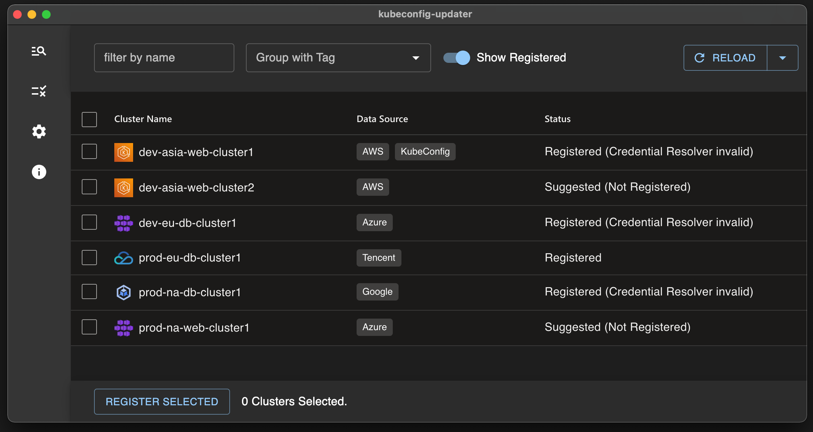

# Kubeconfig-Updater

GUI Kuberentes config file manager app. It suggests your cloud profiles and available clusters.



## Downloads
[Github Releases](https://github.com/pubg/kubeconfig-updater/releases)

| FileName             | Kind         | OS      | Architecture |
|----------------------|--------------|---------|--------------|
| win-x64.zip          | Portable Zip | Windows | x86-64       |
| win-x64.exe          | Installer    | Windows | x86-64       |
| win-arm64.zip        | Portable Zip | Windows | Arm64        |
| win-arm64.exe        | Installer    | Windows | Arm64        |
| linux-x64.AppImage   | AppImage     | Linux   | x86-64       |
| linux-x64.tar.gz     | tar.gz       | Linux   | x86-64       |
| linux-arm64.AppImage | AppImage     | Linux   | Arm64        |
| linux-arm64.tar.gz   | tar.gz       | Linux   | Arm64        |
| mac-universal.zip    | App          | MacOS   | Universal    |
| mac-x64.zip          | App          | MacOS   | x86-64       |
| mac-arm64.zip        | App          | MacOS   | Arm64        |

## Config Store Path
Config stored under your HOME directory.
```
Windows: /Users/<username>/.kubeconfig-updater-gui
Linux: /home/<username>/.kubeconfig-updater-gui
MacOS: /Users/<username>/.kubeconfig-updater-gui
```

## Requirement Permission
```yaml
# AWS Policy 
{
  "Version": "2012-10-17",
  "Statement": [
    {
      "Effect": "Allow",
      "Action": [
        "ec2:DescribeRegions",
        "eks:ListClusters",
        "eks:DescribeCluster",
        "eks:AccessKubernetesApi"
      ],
      "Resource": "*"
    }
  ]
}
```

```yaml
# Azure Role
BuiltinRole: Azure Kubernetes Service Cluster User Role
```

```yaml
# TencentCloud Policy
# You can use Preset Policy That Named 'QcloudTKEReadOnlyAccessPreset' or Custom Policy
{
  "version": "2.0",
  "statement": [
    {
      "action": [
        "cvm:DescribeRegions",
        "tke:DescribeClusters",
        "tke:DescribeClusterKubeconfig"
      ],
      "resource": "*",
      "effect": "allow"
    }
  ]
}
                 

```

## Other Documents
[Update History](./Update-history.md)

[Roadmap](./Roadmap.md)

# Develop Requirements

### Frontend
1. Node.js 16 LTS
2. pnpm

### Backend
3. Golang 1.17
4. goreleaser

# Application Architecture


# Useful Commands

## Frontend

```bash
# Init Project
cd electron-app
npm install
npm run start
```

## Backend

```bash
# Build with goreleaser
cd backend
goreleaser build --rm-dist --snapshot

# Build with go mod (for develop)
cd backend
go build main.go -o kubeconfig-updater-backend

# AS API Server
kubeconfig-updater server --port=9080 --web-port=9081 --mock=false

# AS Standalone Cli
kubeconfig-updater register eks us-east-1 aws-test-cluster
kubeconfig-updater register aks my-rg azr-test-cluster
kubeconfig-updater register tke ap-hongkong tc-test-cluster
```

## Package
```bash
# Full Packging
cd electron-app
make package-all

# Build Frontend and Package Only
cd electron-app
make package-only
```
